# Table of Contents

- Lab 1 - Build (Skip this)
- [Lab 2 - Continuous Deployment - Frontend (Start here)](#user-content-lab-2---continuous-deployment---frontend)
- [Lab 3 - Continuous Deployment - Backend](#user-content-lab-3---continuous-deployment---backend)
- [Lab 4 - Artifact Registry](#user-content-lab-4---artifact-registry)
- [Lab 5 - Policy, Governance & Change Management](#user-content-lab-5---policy-governance--change-management)
- [Lab 6 - Continuous Verification](#user-content-lab-6---continuous-verification)
- [Lab 7 - Release Validation & Automatic Rollback](#user-content-lab-7---release-validation--automatic-rollback)
- [Lab 8 - Automated Security Standards Enforcement](#user-content-lab-8---automated-security-standards-enforcement)
- [Lab 9 - Enhanced Change Management Automation (Optional)](#user-content-lab-9---enhanced-change-management-automation)

<details>
  <summary><strong>Lab 1 - Build (Skip This Lab - Reference Only)</strong></summary>

> **Note:** This lab has been pre-completed for you. We will walk through the configuration during the workshop introduction, but you will not need to create these steps. This pipeline is already set up and ready to use in subsequent labs.

## Summary
Setup a CI Pipeline, including running source code tests, building the executable, and building and pushing the artifact to Harness Artifact Registry.

## Objectives:
- Understand how to configure a basic pipeline using Harness CI
- Review how to build and deploy an artifact to an artifact repository using Harness CI
- Understand how unit tests are integrated into the build process using Harness CI

## Why It Matters:
This lab establishes the starting point of the software delivery lifecycle and ensures artifacts entering the deployment process are consistent, repeatable, and traceable. While CI is not the focus of this POC, this lab validates that Harness cleanly integrates with existing CI workflows and produces deployable artifacts that downstream CD and Artifact Registry processes can rely on.

## Steps

**1.** From the Unified View left navigation bar, navigate to **Projects** → **Select the project available**


**2.** From the Unified View left navigation bar select **Pipelines**

**3.** Click **+ Create a Pipeline**, enter the following values, then click **Start**

   | Field | Value | Notes |
   | ----  | ----- | ----- |
   | Name | workshop | *This is the name of the pipeline* |
   | How do you want to setup your pipeline? | Inline | *This indicates that Harness (rather than Git) will be the source of truth for the pipeline* |

**4.** From Pipeline Studio, Click **Add Stage** and select **Build** as the Stage Type

**5.** Enter the following values and click on **Set Up Stage**

   | Input | Value | Notes |
   | ----  | ----- | ----- |
   | Stage Name | Build | *This is the name of the stage* |
   | Clone Codebase | Enabled | *This indicates that the codebase will be cloned* |
   | Repository Name | harnessrepo | *This is the name of the repository* |

**6.** There are **two** main tabs that need configuration:

   ### Infrastructure

   | Input | Value | Notes |
   | ----  | ----- | ----- |
   | Infrastructure | Cloud | *Harness Cloud provides managed build infrastructure on demand* |

   ### Execution

   - Select **Add Step**, then **Add Step** again, then select **Test Intelligence** from the Step Library and configure with the following

   | Input | Value | Notes |
   | ----  | ----- | ----- |
   | Name | Run Tests With Intelligence | *Test Intelligence speeds up test execution by running only the tests that are relevant to the changes made in the codebase.* |
   | Command | pip install pytest & cd ./python-tests | *The github repo is a monorepo with application(s) and configuration in the same repo. Therefore we need to navigate to the application subfolder* |

   - After completing configuration select **Apply Changes** from the top right of the configuration popup

   - Select **Add Step**, then **Use template** (In this step we will be building the binary following same config as before. To avoid duplication of efforts a template has been precreated)

   | Input | Value | Notes |
   | ----- | ----- | ----- |
   | Template Name | Compile Application | *This template provides us a reusable and standard way to build Angular applications* |

   - Select the template and press **Use Template,** then provide a name for that template

   | Input | Value | Notes |
   | ----- | ----- | ----- |
   | Name  | Compile | *Name of the template in the pipeline* |

   - Select **Add Step**, then **Add Step** again, then select **Build and Push an image to Docker Registry** from the Step Library and configure with the following

   | Input | Value | Notes |
   | ----- | ----- | ----- |
   | Name  |Push to Harness AR | |
   | Registry Type | Artifact Registry | |
   | Registry | har-<your_project_id> | *Replace with your actual Harness project ID (e.g., har-1234567890)* |
   | Tags | <+variable.username>-<+pipeline.sequenceId> | *This will be the tag of the image using harness expressions. Click on the pin and select expression and paste the value* |
   | **Optional Configuration** | | |
   | Dockerfile | /harness/frontend-app/harness-webapp/Dockerfile |  *This tells harness where is the Dockerfile for building the app* |
   | Context | /harness/frontend-app/harness-webapp | *This tells from where to run the instructions included in the dockerfile* |

   - Click **Apply Changes** to close the config dialog

**7.** Click **Save** and then click **Run** to execute the pipeline with the following inputs

   | Input | Value | Notes |
   | ----- | ----- | ----- |
   | Branch Name | main | *This is prepopulated* |

</details>

---

# Lab 2 - Continuous Deployment - Frontend

## Summary: 
Our application compiled successfully and the artifact is in the Harness Artifact Registry. Time to deploy it. Extend the pipeline to ship the frontend to a Kubernetes cluster using a rolling deployment. The manifests are ready, no manual kubectl commands, no deployment scripts to maintain, just point Harness at your manifests and let it handle the rest.

## Objectives

- Extend CI pipelines with Continuous Deployment stages
- Define Kubernetes services with manifests and artifact sources
- Use Harness expressions for dynamic artifact tagging
- Implement rolling deployment strategies

## Why It Matters
This lab demonstrates how application teams deploy software without custom scripts, using a standardized, visual pipeline model. Participants validate how environments, approvals, and promotions are handled consistently while maintaining speed and control.

## Steps
**1.** From the Unified View left navigation bar, navigate to **Projects** → **Select the project available**


**2.** In the Pipeline Studio, add a Deployment stage by clicking **Add Stage** and select **Deploy** as the Stage Type.

**3.** Enter the following values and click on **Set Up Stage**

   | Input | Value | Notes |
   | ----- | ----- | ----- |
   | Stage Name | frontend | |
   | Deployment Type | Kubernetes | |

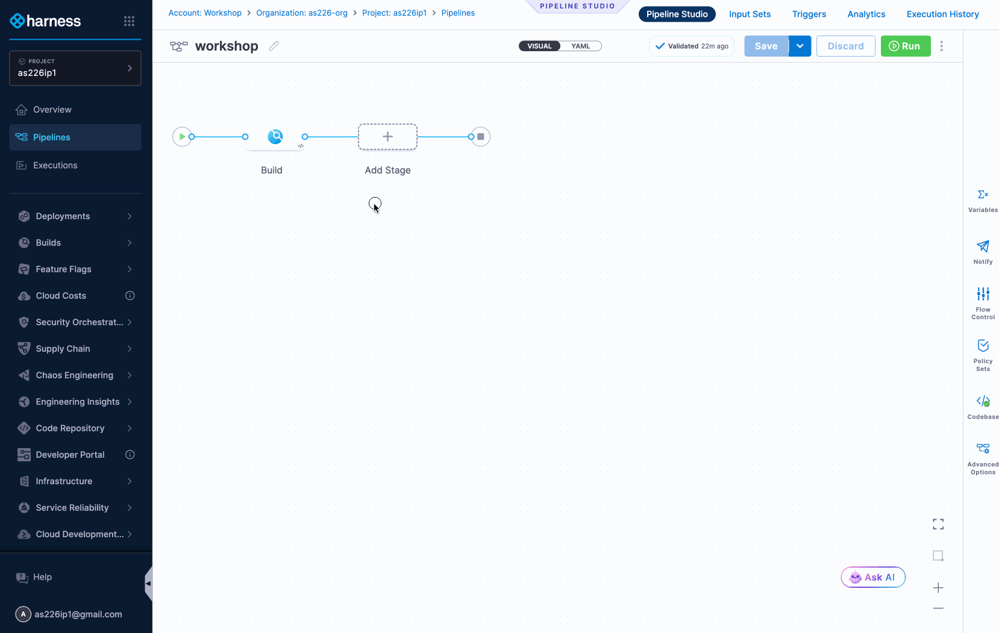

**4.** Configure the **frontend** Stage with the following

   ### Service

   - Click **+Add Service** and configure as follows

   | Input | Value | Notes |
   | ----- | ----- | ----- |
   | Name | frontend | |
   | Deployment Type | Kubernetes | |
   | **Add Manifest** | | |
   | Manifest Type | K8s Manifest | |
   | K8s Manifest Store | Code | |
   | Manifest Identifier | templates | |
   | Repository | harnessrepo | |
   | Branch | main | |
   | File/Folder Path | harness-deploy/frontend/manifests | |
   | Values.yaml | harness-deploy/frontend/values.yaml | _Click **Submit** to go back and continue configuration of the artifact source_ |
   | **Add Artifact Source** | | |
   | Artifact Repository Type | Artifact Registry | |
   | Artifact Source Identifier |frontend | |
   | Registry | har-<your_project_id> | |
   | Image Name | harness-workshop | |
   | Tag | <+variable.username>-<+pipeline.sequenceId> | _Click on the purple "**Sigma**" icon to the right of the text box. A "Learn More" pop up will appear and block your view, click the "**x**" to exit it. Then select **Expression** from the dropdown and paste the value._ |

   - Click **Save** to close the service window and then click **Continue** to go to the Environment tab

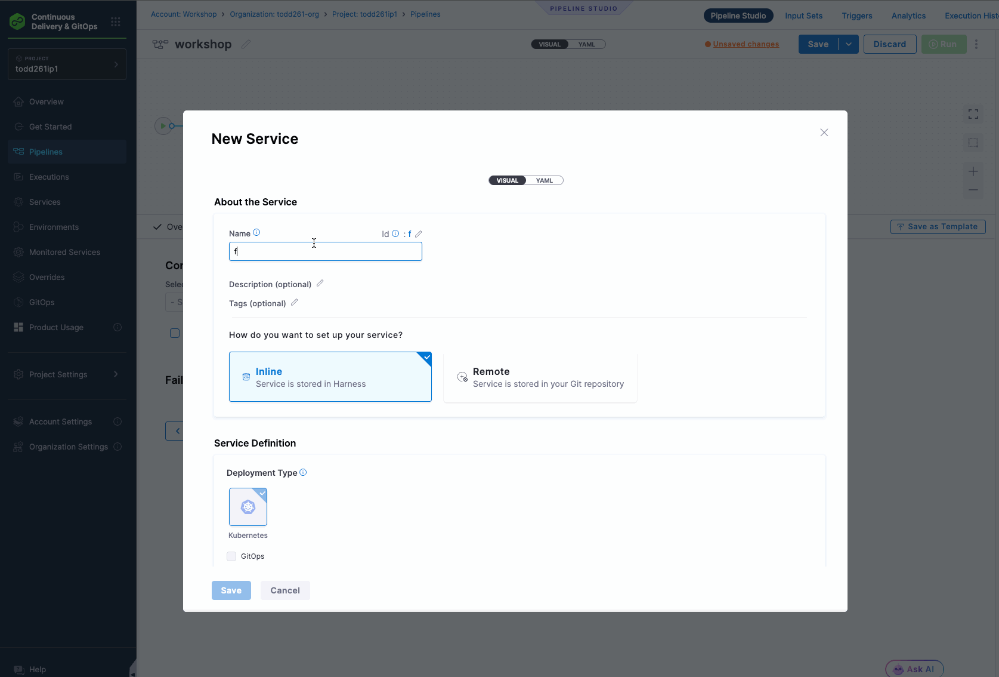

   ### Environment

   The target infrastructure has been pre-created for us. The application will be deployed to a Kubernetes cluster on the given namespace  

   - Click **- Select -** on the **"Specify Environment"** input box

   - Select **prod** environment and click **"Apply Selected"**

   - Click **- Select -** on the **"Specify Infrastructure"** input box

   -  From the dropdown select **k8s** and click **"Apply Selected"**

   - Click **Continue** 

   ### Execution Strategies

   - Select **Rolling** and click on **Use Strategy**, the frontend is a static application so no need to do canary.

   - **Save** the pipeline.

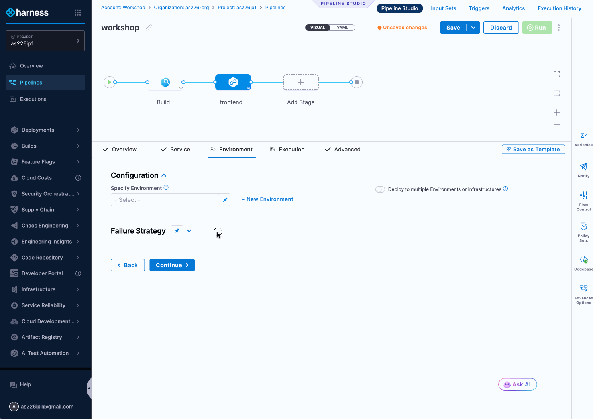

---
# Lab 3 - Continuous Deployment - Backend

## Summary
Frontend is done. Now for the backend, where things can actually break in expensive ways. Let's use a canary deployment strategy with a manual approval before a broad rollout in order to minimize the blast radius. Deploy to a small slice of traffic, verify the canary is healthy, then promote to everyone. Progressive delivery made easy. 

## Objectives
- Extend the pipeline with multiple deployment stages for different services
- Implement advanced deployment strategies to reduce blast radius of a release
- Add manual approval gates and keep the human in the loop for controlled production releases

## Why It Matters
This lab validates Harness’s ability to safely deploy changes to production using advanced deployment strategies. Participants experience how risk is reduced through progressive delivery, automated rollback, and built-in failure handling — without complex scripting.
## Steps
**1.** In the existing pipeline, add a Deployment stage by clicking **Add Stage** and select **Deploy** as the Stage Type

**2.** Enter the following values and click on **Set Up Stage**

   | Input | Value | Notes |
   | ----- | ----- | ----- |
   | Stage Name | backend | |
   | Deployment Type | Kubernetes | |

**3.** Configure the **backend** Stage with the following

   ### Service

   - Click **- Select -**  on the **"Select Service"** input box and select **backend** (this was preconfigured for you)

   - Click **Apply Selected** and then click **Continue** to go to the **"Environment"** tab

   ### Environment
   - Click **- Select -** on the **"Specify Environment"** input box

   - Select **prod** environment and click **"Apply Selected"**

   - Click **- Select -** on the **"Specify Infrastructure"** input box

   -  From the dropdown select **k8s** and click **"Apply Selected"**

   - Click **Continue** 

   ### Execution

   - Select **Canary** and click on **Use Strategy**

   - **After** the canary deployment and **before** the canary delete step add **Harness Approval** step according to the table below

     | Input | Value | Notes |
     | ----- | ----- | ----- |
     | Name  | Approval | |
     | User Groups | All Project Users | Select project to see the **"All Project Users"** option |


   - Click **Apply Changes** at the top right.

**4.** Click **Save** and then click **Run** to execute the pipeline with the following inputs.

> **Bonus**: save your inputs as an Input Set before executing

   | Input       | Value | Notes       |
   | ----------- | ----- | ----------- |
   | backend_version | backend-v1 | _Leave as is_ |
   | Branch Name |main| _Leave as is_ |
   | Stage: frontend | frontend | _Leave as is_ |
   | Stage: backend | backend | _Leave as is_ |


**5.** While the canary deployment is ongoing and waiting **approval** navigate to the web page and see if you can spot Captain Canary (use the Check Release button to refresh) 

   | Project | Domain | Suffix |
   | ------- | ------ | ------ |
   | http\://<your_project_id> | .cie-bootcamp | .co.uk |


**6.** Approve the canary deployment for the pipeline to complete and go back to the web page and you should see Captain Canary has left as his work here is done.

---

# Lab 4 - Artifact Registry

## Summary
This lab focuses on managing and securing your container images through Harness Artifact Registry. You'll learn how to configure your registries to automatically scan images for vulnerabilities, pull images from the registry, and leverage upstream proxies to control images pulled from public repositories. 

## Objectives
- Configure artifact registries for vulnerability scanning
- Set up upstream proxies for secure image pulling

## Why It Matters
This lab demonstrates how Harness Artifact Registry helps you secure your container images by automatically scanning them for vulnerabilities and providing secure image pulling through upstream proxies, reducing the risk of supply chain attacks.

## Steps
### Automatically scan images for vulnerabilities

**1.** From the Unified View, navigate to **Artifact Repositories --> Registries** in the left navigation bar

**2.** Click on the **har-<your_project_id>** registry.

**3.** Click the **Configuration** tab at the top to pull up the registry settings.

**4.** Find the **Security** configuration section. Turn on automated image scanning with one click by checking the box next to AquaTrivy.

**5.** Find the **Advanced (Optional)** configuration section and expand it. Notice the Org-level Upstream Proxy that's already been configured for you.

**6.** Click the **Save** button at the top of the page to save your changes.

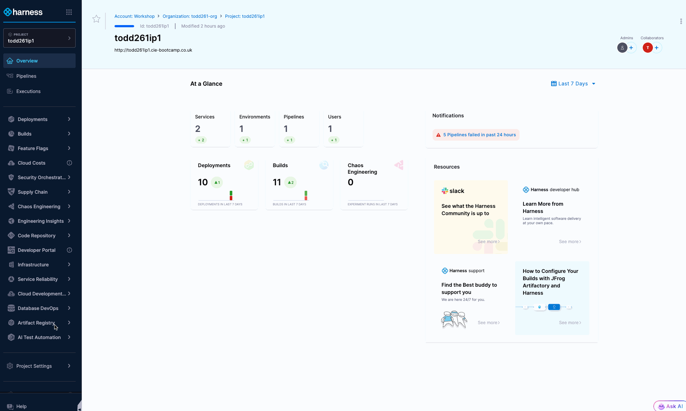

### Improved developer workflows - easily push and pull images

**1.** From the **har-<your_project_id>** registry, click the Artifacts tab to find the **harness-workshop** image and click on the link to the image. Expand the "-1" version and click on the digest hyperlink. Finally, click the **Set Up Client** button in the upper right corner.

**2.** On **Step 2** of the Docker Client Setup pop-up, click the **Generate Token** link to generate a token you'll use to authenticate to this registry. Paste the key in a text editor that can be referenced later.

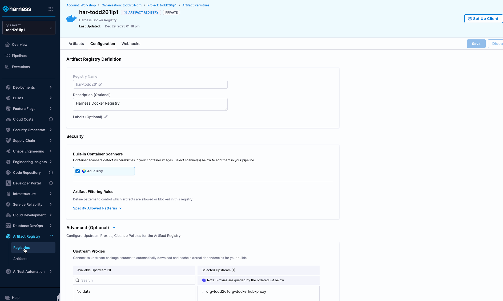

**3.** Copy the provided Docker configuration commands and run them from your local machine or cloud shell to configure your Docker client to pull the **harness-workshop** image to your machine, re-tag it (e.g., `latest`), and push back to Harness Artifact Registry. E.g.:

```bash
docker login pkg.harness.io -u <your_workshop_username> -p <your_token>
docker pull pkg.harness.io/ifg41dwvsnarlovnb2uesg/har-<your_project_id>/harness-workshop:<your_project_id>-1
docker tag pkg.harness.io/ifg41dwvsnarlovnb2uesg/har-<your_project_id>/harness-workshop:<your_project_id>-1 pkg.harness.io/ifg41dwvsnarlovnb2uesg/har-<your_project_id>/harness-workshop:latest
docker push pkg.harness.io/ifg41dwvsnarlovnb2uesg/har-<your_project_id>/harness-workshop:latest
```

**4.** From the Unified View in the left navigation bar, click on **Pipelines** and you should see the Artifact Scan Pipeline running. This will take a couple minutes to complete.

**5.** While the pipeline is running, navigate back to your local machine terminal and pull an image that's publicly available on Docker Hub. Use the same URL from the previous Set Up Client wizard, substituting your public image for _harness-workshop:<tag>_. E.g.:

```bash
docker pull pkg.harness.io/ifg41dwvsnarlovnb2uesg/har-<your_project_id>/alpine:latest
```
From a developer experience perspective, developers have a single URL to use for any artifact they want to store or retrieve - public or private - reducing cognitive load and simplifying artifact management.

**6.** After the scan pipeline has finished, navigate back to _Artifact Registry --> Artifacts --> (Expand) **harness-workshop:latest** --> click on the digest hyperlink._ You should see the scan results under the "Vulnerabilities" tab. _Extra Credit: while you're here, take a look at the SBOM tab to understand the composition of the artifact we built, including the open source dependencies._

---
# Lab 5 - Policy, Governance & Change Management

## Summary
You've built a pipeline that builds, tests, and deploys your frontend and backend services. Now the compliance team wants a word. In regulated environments, you can't just ship code to production without following change compliance policies and maintaining an audit trail for traceability. In this lab, we'll enforce governance with Policy-as-Code, ensuring every pipeline has an approval gate, and integrate with ServiceNow for automated change management. Compliance as code, not compliance as bottleneck.

## Objectives

- Enforce governance guardrails using Policy as Code (OPA)
- Integrate ServiceNow for automated change request creation and approval
- Understand how policies prevent non-compliant pipelines from being executed, or even saved.

## Why It Matters
This lab proves that governance does not have to be manual, inconsistent, or slow. Participants validate how organizational policies are enforced automatically across all pipelines, eliminating human bottlenecks while preserving auditability.

## Steps

### Policy as Code

**1.** At the bottom of the Unified View left navigation bar hover over **Project Settings** and select **Policies** from the expanded menu.

**2.** At the top right click on **Policies** and select **Approval Required Policy** and review the policy.

**3.** Click on the **Select Input** button on the right and select these values from each dropdown:

   | Input | Value |
   | ----- | ----- |
   | Entity Type | Pipeline |
   | Organization | {your-org} |
   | Project | {your-project} |
   | Action | On Save |

**4.** Select your most recent pipeline save and click **Apply**.

**5.** Now click on the green **Test** button on the right. What do you think will happen?

> **Note:** Since the policy checks that we have an approval before any deployment stage, it's expected that it failed. Failure is success! The policy is working as designed.

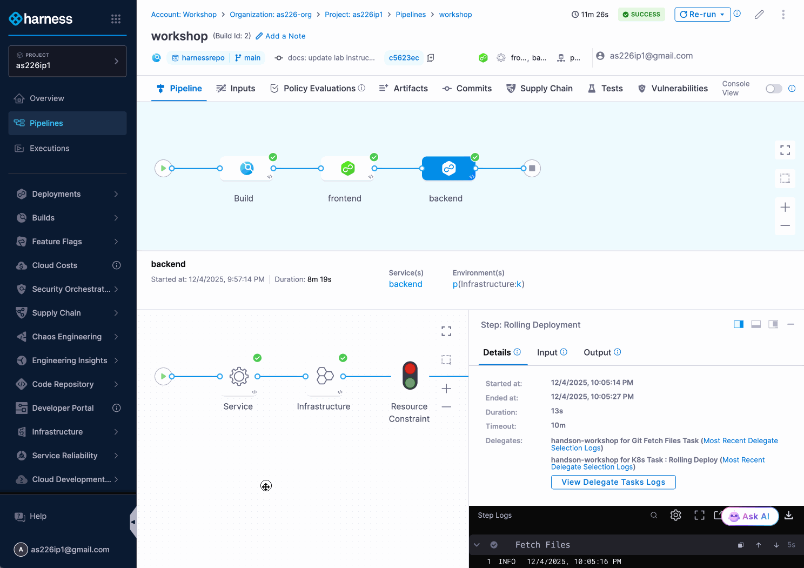

**6.** Let's now enforce it. Click on **Policy Sets** from the top right.

**7.** Find the **Approval Required Policy Set** and click on the **Enforced** toggle to turn it on

### Governance in Action

**1.** Head back over to our pipeline by selecting **Pipelines** from the Unified View left navigation bar.

**2.** Let's make a small edit to our pipeline so we can save it. Click on the pencil icon next to the pipeline name.

**3.** Now click on the pencil icon next to the **Tags** section and add a tag. You can get creative here :)

**4.** Click **Continue** then **Save** your pipeline.

> **Note:** As we expected, we are not allowed to save our pipeline until we've added an Approval. Let's fix it!

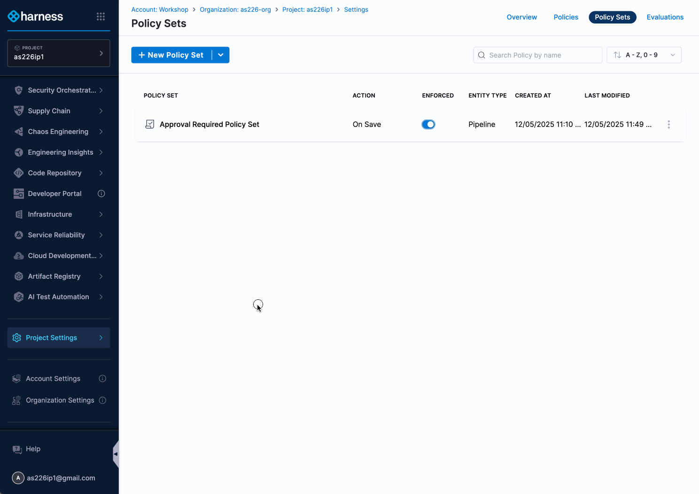

### Approvals via ServiceNow Change Requests

**1.** Hover before the **frontend** stage and click on the **+** icon that appears to add a new stage.

**2.** Click **Use Template**

**3.** Select the **SNOW Approval** template and click on **Use Template** in the lower right corner.

**4.** Name it `ServiceNow Approval` and click **Set Up Stage**.

> **Note:** Make sure you name it `ServiceNow Approval` as we will add steps later that reference this stage.

**5.** This template has been preconfigured for us, so there are no inputs necessary

**6.** Click on the **Overview** toggle to see the steps in this template. 

**7.** Click on the **Create Ticket** or **Approval** steps to see how they are configured and notice how you, as a template user, cannot change the configuration for this enterprise-approved template — only the template administrator can make changes. Click the **X** or **Discard** once you're done reviewing.

> **Note:** Notice the use of Harness Expressions to dynamically populate our tickets and approvals.

**8.** Save the pipeline. No violations this time, hooray for compliance!

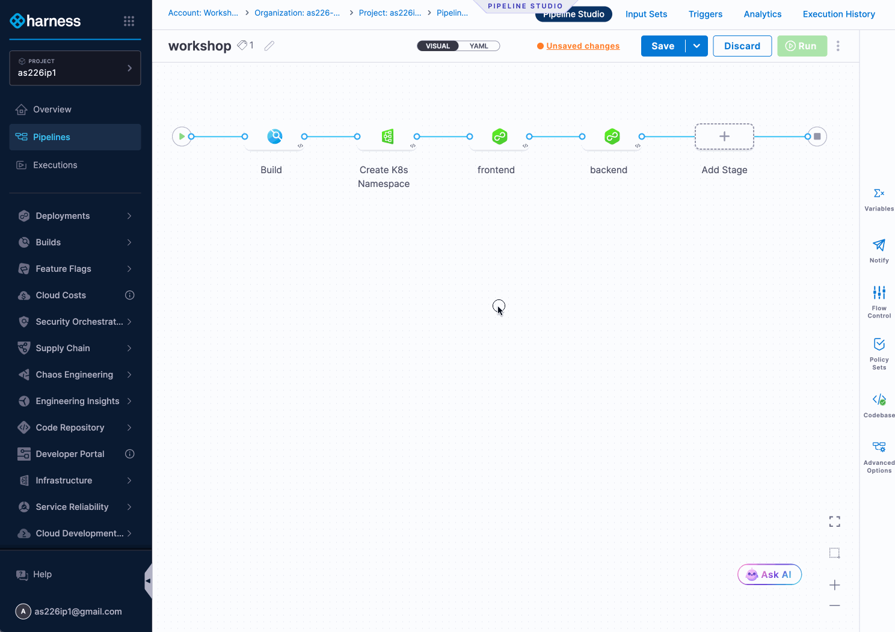

> **Bonus:** Add a step to close the ServiceNow ticket after the last step of the **backend** stage, indicating that we've successfully deployed to production. *Hint: there's a template already created.*

---

# Lab 6 - Continuous Verification

## Summary
Canary deployments are great, but how do you know the canary is actually healthy? Continuous verification integrates with your observability tools and uses ML to compare metrics and logs against the baseline in real-time. No manual dashboard watching required. We'll also add chaos experiments to stress-test the deployment. If the canary survives intentional chaos, it's ready for production.

## Objectives
- Configure continuous verification to compare canary metrics against baseline using ML
- Add chaos experiments to stress-test deployments during the canary phase
- Automate go/no-go decisions based on real-time observability data

## Why It Matters
This lab validates how Harness detects deployment issues based on real system behavior, not just pipeline success. Participants experience how deployments are continuously verified using telemetry + AI/ML, enabling faster detection and rollback of bad releases before they impact users, eliminating the need for manual monitoring, and reducing time-to-market.

## Steps
**1.** Click on the **backend** deployment stage and hover over the **Approval** step. Delete it by clicking the **x**. We no longer need a manual approval since we will add automated deployment validation next.

**2.** Between the **Canary Deployment** and **Canary Delete** steps, click the **+** icon to add a new step

**3.** Add a **Verify** step with the following configuration

   | Input | Value | Notes |
   | ----- | ----- | ----- |
   | Name | Verify | |
   | Continuous Verification Type | Canary | |
   | Sensitivity | High | _Defines how sensitive the ML algorithms are to deviation from the baseline_ |
   | Duration | 5mins | |

**4.** Within the Verify step configuration panel, select the **Advanced** tab and expand the **Failure Strategy** section. In the **Perform Action** configuration, change the behavior to **Rollback Stage**.

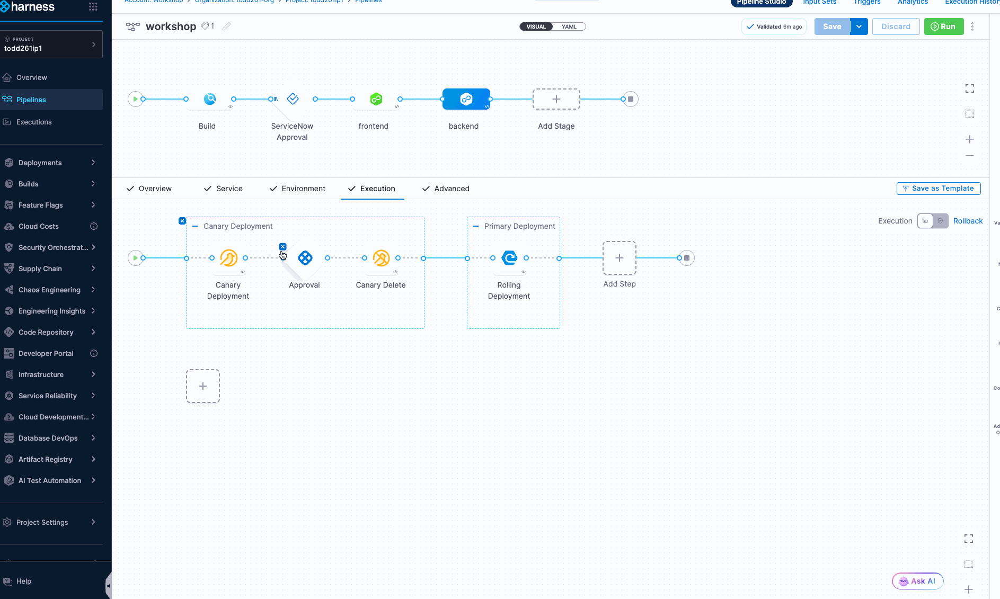

**5.** Under the Verify step, click the **+** icon to add a new step **in parallel**

   

**6.** Add a **Chaos** step with the following configuration

   | Input | Value | Notes |
   | ----- | ----- | ----- |
   | Name | Chaos | |
   | Select Chaos Experiment | <project_name>-pod-memory | _Select the existing experiment from the list_ |
   | Expected Resilience Score | 50 | _Should already be populated for you_ |

**7.** Click on Apply Changes

**8.** Click **Save**

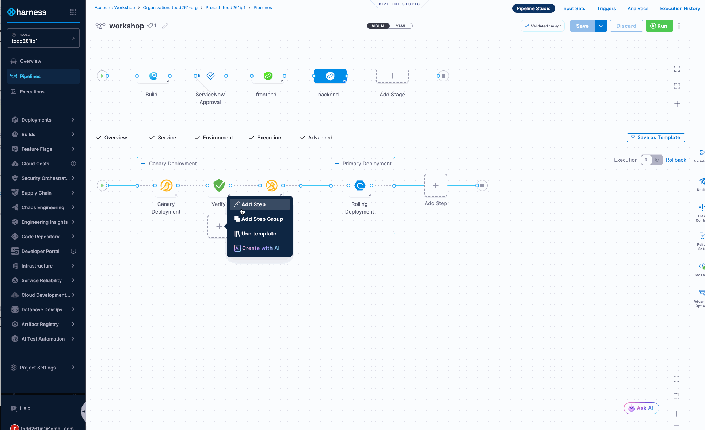

---

# Lab 7 - Release Validation & Automatic Rollback

## Summary
This is where it all comes together. Watch the entire delivery pipeline flow from commit to production: multi-service deployments, automated change management with ServiceNow approvals, canary deployments validated by ML-powered verification, and chaos experiments checking the resiliency of your release. If something breaks, the pipeline rolls back automatically. No war rooms, only pizza parties.

## Objectives
- Execute the full golden path pipeline end-to-end
- Observe canary vs baseline traffic distribution in real-time
- Approve ServiceNow change requests to progress deployments
- Validate automated rollback if verification fails

## Why It Matters
This lab demonstrates the full power of a modern CD platform by combining multiple safety mechanisms into a single, automated pipeline. You'll see how ServiceNow approvals ensure proper change control, how AI/ML-powered continuous verification provides objective health signals, and how chaos engineering validates real-world resilience - all working together to deliver software with confidence while maintaining system stability.

## Steps
**1.** First, we need to deploy a new version of our backend to the canary environment so we can demonstrate how to rollback a failed release. Click the **Run** button in the upper right corner to execute the pipeline but this time, select the backend-v2 in the dropdown box that pops up.

   | Input | Value | Notes |
   | ----- | ----- | ----- |
   | backend_version | backend-v2 | _Update from v1 to v2_ |
   | Branch Name | main | _Leave as is_ |
   | Stage: frontend | frontend | _Leave as is_ |
   | Stage: backend | backend | _Leave as is_ |

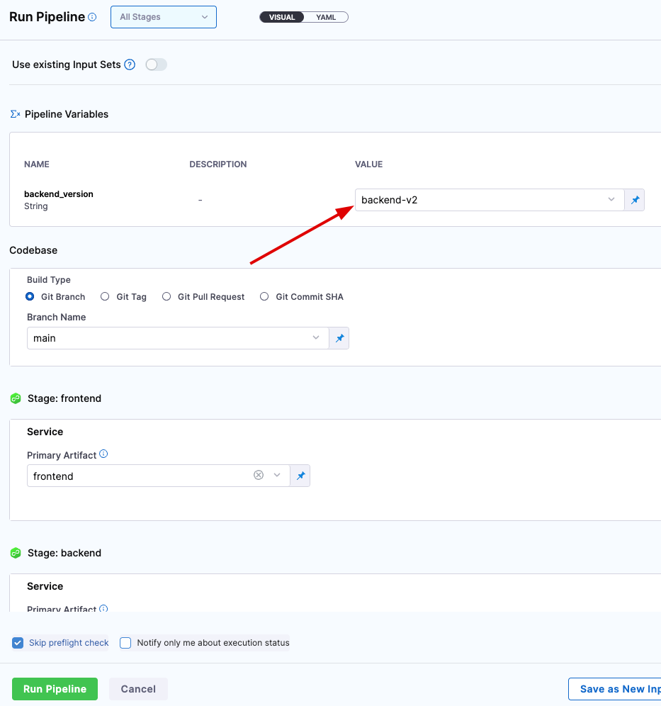

**2.** The pipeline will eventually pause on the ServiceNow Approval stage. At this point, the orchestration pipeline automatically created the SNOW change record on behalf of you (the developer) and updated the ticket with the details needed for a release. No manual change records to maintain by the developer - everything is automated. Next, let's simulate a release manager signing off on the implementation.

- Click on the **ServiceNow Approval** stage, click on the **Approval** step, and click on the change record hyperlink in the step details on the right to open the change record in a new tab.

- Next, login to the SNOW sandbox instance with the name **workshopuser** and the same password you used to log in to the lab. Click the Implement button in the upper right corner. While you're there, observe the metadata provided by the pipeline. Click back to the Harness tab in your browser and observe the pipeline progressing once the change record was approved.


**3.** As the pipeline progresses to the backend deployment, navigate to the web page and see if you can spot the canary (use the check release button). 

   | project                | domain        | suffix |
   | ---------------------- | ------------- | ------ |
   | http\://\<project\_id> | .cie-bootcamp | .co.uk |

- Validate that we've deployed the new version in the canary by checking the version is **backend-v2** and the Last Execution matches the **build Id** of your pipeline

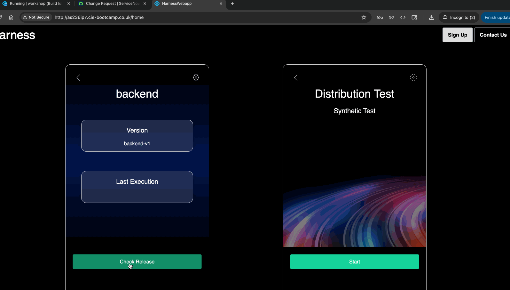

------

**4.** Next we're going to generate some traffic to the canary to test the automated release validation. Click the **Start** button in the Distribution Test panel.

- Observe the traffic distribution. You should see traffic routing to a subset of the infrastructure.


**5.** Switch back to the Harness tab in your browser to observe the pipeline behavior. The Chaos experiment and Continuous Verification steps will run for approximately 5 minutes. Wait for them to complete.

**6.** Once the Verify step completes, select it and notice that **1 out of 1 metric is in violation**. Click **View Details ->** to inspect the failure.

**7.** Harness ingests telemetry from Prometheus to determine the health of the release. You'll see that the **Pod Memory** metric is flagged as anomalous. Expand it to examine its behavior:

- The **solid red line** represents the canary's memory usage, which is growing in an unbounded way
- The **dotted blue line** represents control data from the previous stable release, showing no memory increase and serving as our baseline

> **Note:** This pattern points to a memory leak in **backend-v2** that would have been difficult to detect without this data. Traditionally, if a service starts up cleanly, we consider it a successful release. But issues like memory leaks only manifest under load over time, making them notoriously hard to diagnose. This is precisely why continuous verification is so crucial, it catches problems that traditional health checks miss.

**8.** Click the **Console View** toggle in the top right to return to the pipeline execution view.

**9.** Notice that because the Verify step failed, Harness automatically initiated a rollback of the canary to the previous stable version. This automated rollback capability eliminates the need for manual intervention during incidents, reduces mean time to recovery and ensures your users are protected from degraded experiences while your team investigates the root cause.

**10.** Finally, navigate back to the web application and verify that we've rolled back to **backend-v1**. Use the **Check Release** button to confirm the canary no longer appears.

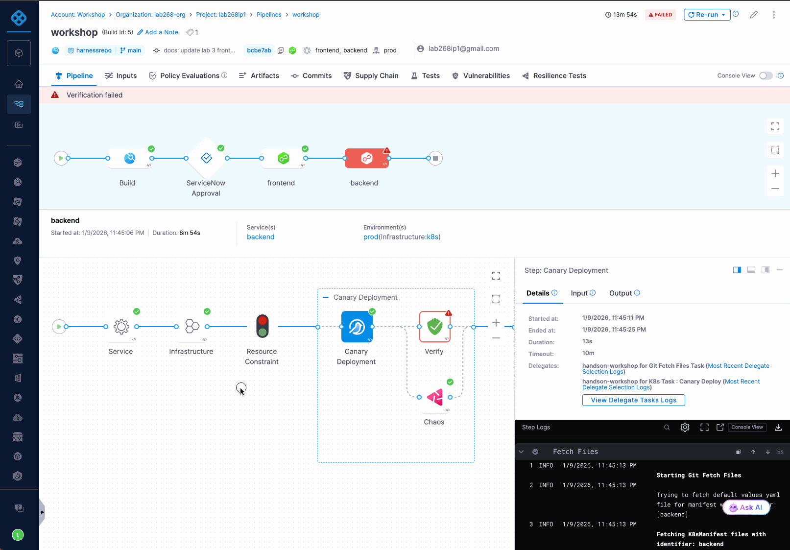

---

# Lab 8 - Automated Security Standards Enforcement

## Summary
Honor system enforcement of security scans is great. Automated enforcement of security scans and blocking bad deployments is better. Using policy-as-code OPA policies, ensure all deployments are scanned for vulnerabilities and automatically turn vulnerability findings into hard stops to ensure critical CVEs never reach production.

## Objectives
- Enforce security standards using centrally-managed OPA policies
- Integrate policy enforcement into deployment pipelines
- Block deployments with critical vulnerabilities before production

## Why It Matters
This lab demonstrates how to enforce security standards automatically across your organization using policy-as-code. By implementing centrally-managed OPA policies, you can ensure that all deployments meet your security requirements before they reach production, eliminating the risk of human error or bypassing of security controls.

## Steps

### Enable Automated Policy Enforcement

**1.** From the Unified View left navigation bar, scroll down and hover over to **Project Settings**. Select **Policies** from the expanded menu.

**2.** Select the **Policy Sets** tab from the top right.

**3.** Toggle the **Enforced** on for both **Criticals Not Allowed** and **Security Scans Required Policy Set**.
> **Note:** The underlying policies were pre-built in your project. _Criticals Not Allowed_ enforces the policy that blocks deployments with critical vulnerabilities. _Security Scans Required Policy Set_ ensures that all deployments have been scanned for security issues.

**4.** Navigate back to your pipeline by clicking **Pipelines** in the Unified View of the left navigation bar.

**5.** Like before, try making a simple change to your pipeline, like adding a tag to the pipeline name and click **Save** in the upper right to see how the policy enforcement behaves.

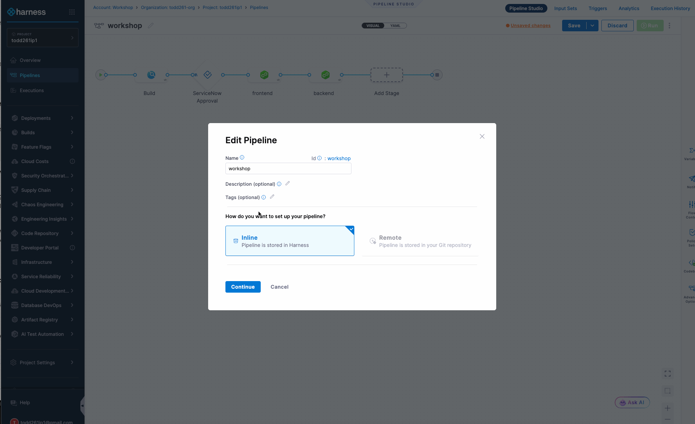

**6.** Align to the enterprise security standards by adding a new stage before the ServiceNow Approval. Hover over the pipeline and click the **+** button to add a new stage. On the pop-up, select **Use Template**.

**7.** Select the Security Scans template and click the **Use Template** button in the lower right corner.

**8.** _**IMPORTANT:** Name the stage **Scan**. This name reference is used downstream in the pipeline so be sure to name it exactly **Scan**._ Click **Set Up Stage**.

**9.** Click **Save** in the upper right corner to save the changes to your pipeline. You are now in compliance with the enterprise security standards so you are allowed to save your changes.

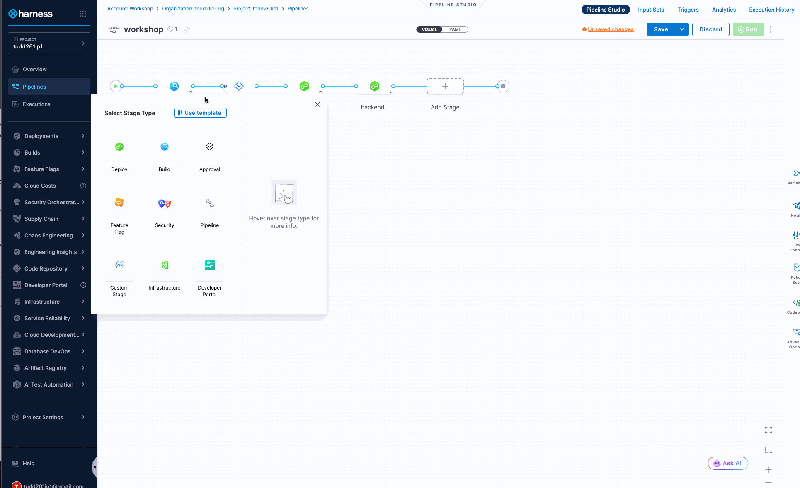

### Automatically Block Critical CVEs in the Pipeline

**1.** Select the **frontend** stage. Hover over the pipeline before the **Rollout Deployment** step, and click the **+** button to add a new step. Then select **Use Template**.

**2.** Select the **Check Critical CVEs** template then click the **Use Template** button in the lower right corner.

**3.** Name the policy step template **Block CVEs** and click **Apply Changes**.

**4.** Save the pipeline and click **Run**. In the run options, select the **backend-v2** version.

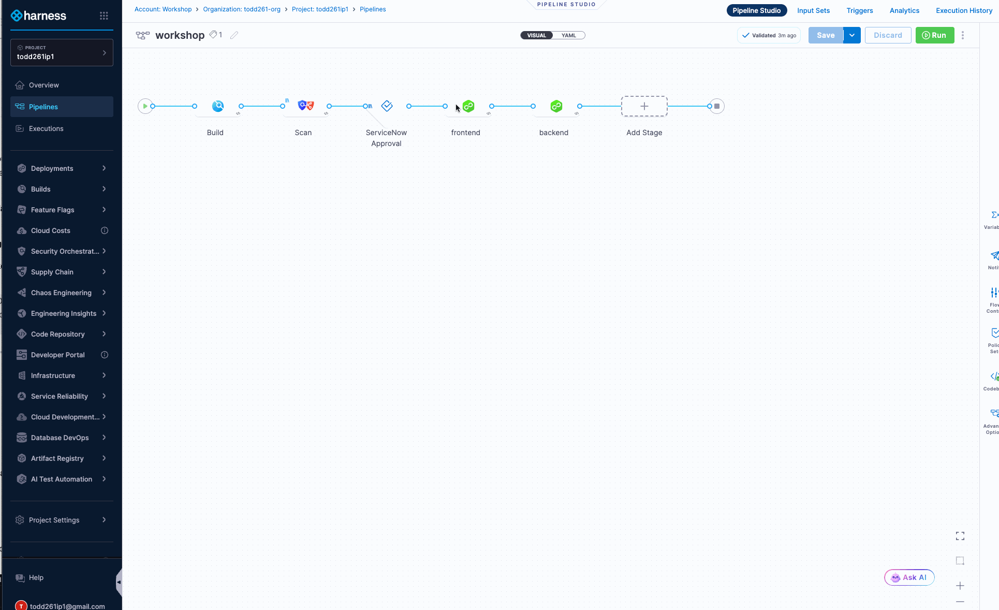

> **Note:** Expect the pipeline to fail at the policy evaluation step. The OWASP scan found critical vulnerabilities, and the policy we just created is doing its job blocking the release before it reaches production. If you'd like to get back in compliance so the pipeline can proceed, navigate to **Project Settings --> Policies --> OWASP CVEs** and change the Rego policy on the left from `critical > 0` to `critical > 6`.

---

# Lab 9 - Enhanced Change Management Automation

## Summary
Close the loop on failed releases. Configure rollback steps that automatically update ServiceNow when deployments fail.

## Objectives
- Configure rollback-specific steps in deployment stages
- Leverage step group templates for automation of complex workflows

## Why It Matters
This lab shows how to close the loop on failed deployments by automatically updating ServiceNow when releases fail, ensuring proper change management and accountability even when automated rollbacks occur.

## Steps
**1.** Navigate to the Edit mode of the Pipeline Studio.

**2.** Click into the Deploy **backend** stage and toggle the Rollback view in the right corner.


**3.** Click the '**+**' button at the end of the pipeline to add a new step and select **Use Template**.

**4.** Select the ServiceNow Close Failed template and give it a name - Close Failed Ticket.

**5.** Apply the changes and Save the pipeline. 

