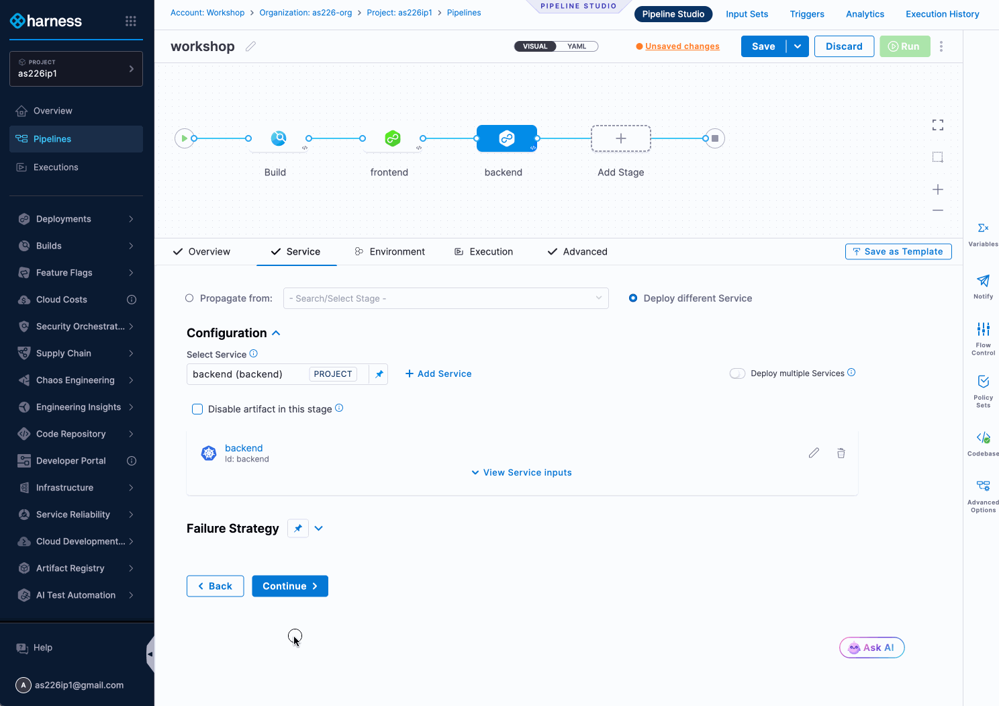
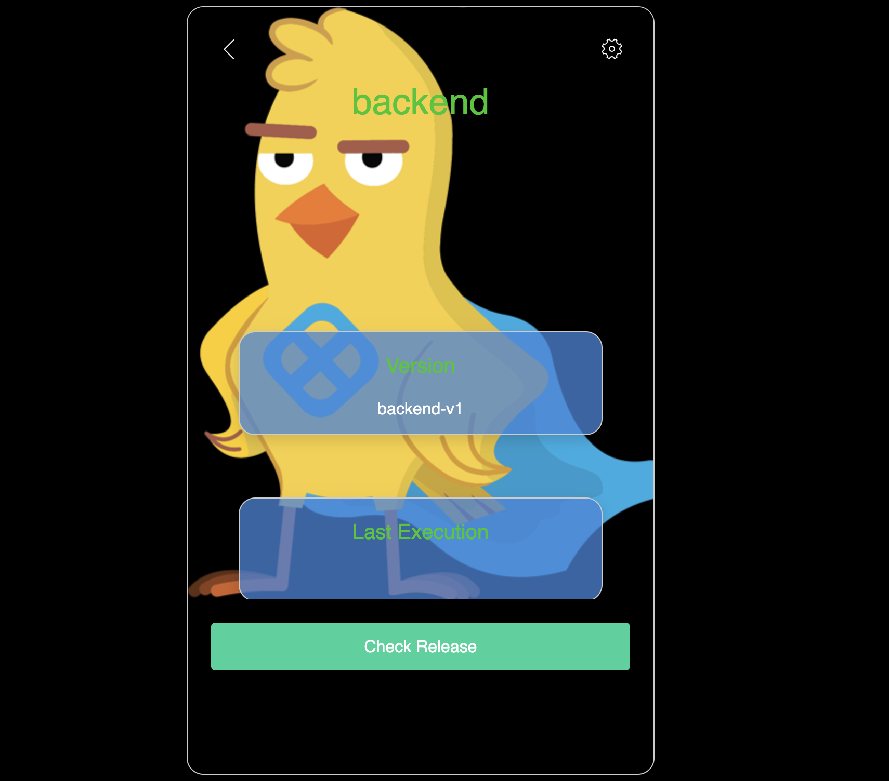
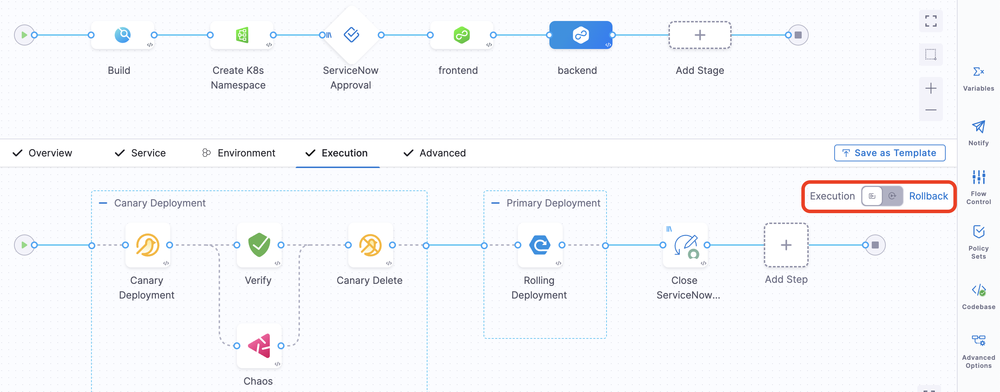
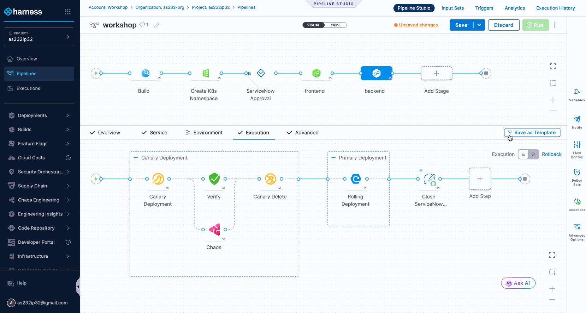

## Table of Contents

- Lab 1 - Build (Skip this)
- Lab 2 - DevSecOps (Skip this)
- [Lab 3 - Continuous Deployment - Frontend (Start here)](#user-content-lab-3---continuous-deployment---frontend)
- [Lab 4 - Continuous Deployment - Backend](#user-content-lab-4---continuous-deployment---backend)
- [Lab 5 - Multicloud Deployments](#user-content-lab-5---multicloud-deployments)
- [Lab 6 - Policy, Governance & Change Management](#user-content-lab-6---policy-governance--change-management)
- [Lab 7 - Continuous Verification](#user-content-lab-7---continuous-verification)
- [Lab 8 - Release Validation & Automatic Rollback](#user-content-lab-8---release-validation--automatic-rollback)
- [Lab 9 - Governance/Policy as Code (Advanced)](#user-content-lab-9---governancepolicy-as-code-advanced)

  
<strong>Lab 1 - Build (Skip This Lab - Reference Only)</strong>

> **Note:** This lab has been pre-completed for you. We will walk through the configuration during the workshop introduction, but you will not need to create these steps. This pipeline is already set up and ready to use in subsequent labs.

## Summary
Setup a CI Pipeline, including running source code tests, building the executable, building and pushing the artifact to a remote repository

### Outcome
A Deployable artifact

### Learning Objective(s):

- Understand how to configure a basic pipeline using Harness CI

- Review how to build and deploy an artifact to a remote repository using Harness CI

- Understand how unit tests are integrated into the build process using Harness CI

## Reference Steps

**1.** From the left hand menu, navigate to **Projects** → **Select the project available**

**2.** From the left hand side menu select **Pipelines**

**3.** Click **+ Create a Pipeline**, enter the following values, then click **Start**

    | Field | Value | Notes |
    | ----  | ----- | ----- |
    | Name | workshop | *This is the name of the pipeline* |
    | How do you want to setup your pipeline? | Inline | *This indicates that Harness (rather than Git) will be the source of truth for the pipeline* |

**4.** From Pipeline Studio, Click **Add Stage** and select **Build** as the Stage Type

**5.** Enter the following values and click on **Set Up Stage**

    | Input | Value | Notes |
    | ----  | ----- | ----- |
    | Stage Name | Build | *This is the name of the stage* |
    | Clone Codebase | Enabled | *This indicates that the codebase will be cloned* |
    | Repository Name | harnessrepo | *This is the name of the repository* |

**6.** There are **two** main tabs that need configuration:

   ### Infrastructure

   | Input | Value | Notes |
   | ----  | ----- | ----- |
   | Infrastructure | Cloud | *Harness Cloud provides managed build infrastructure on demand* |

   ### Execution

   - Select **Add Step**, then **Add Step** again, then select **Test Intelligence** from the Step Library and configure with the following

   | Input | Value | Notes |
   | ----  | ----- | ----- |
   | Name | Run Tests With Intelligence | *Test Intelligence speeds up test execution by running only the tests that are relevant to the changes made in the codebase.* |
   | Command | pip install pytest & cd ./python-tests | *The github repo is a monorepo with application(s) and configuration in the same repo. Therefore we need to navigate to the application subfolder* |

   - After completing configuration select **Apply Changes** from the top right of the configuration popup

   - Select **Add Step**, then **Use template** (In this step we will be building the binary following same config as before. To avoid duplication of efforts a template has been precreated)

   | Input | Value | Notes |
   | ----- | ----- | ----- |
   | Template Name | Compile Application | *This template provides us a reusable and standard way to build Angular applications* |

   - Select the template and press **Use Template,** then provide a name for that template

   | Input | Value | Notes |
   | ----- | ----- | ----- |
   | Name  | Compile | *Name of the template in the pipeline* |

   - Select **Add Step**, then **Add Step** again, then select **Build and Push an image to Docker Registry** from the Step Library and configure with the following

   | Input | Value | Notes |
   | ----- | ----- | ----- |
   | Name  |Push to DockerHub | |
   | Docker Connector | dockerhub | |
   | Docker Repository | nikpap/harness-workshop | |
   | Tags | <+variable.username>-<+pipeline.sequenceId> | *This will be the tag of the image using harness expressions. Click on the pin and select expression and paste the value* |
   | **Optional Configuration** | | |
   | Dockerfile | /harness/frontend-app/harness-webapp/Dockerfile |  *This tells harness where is the Dockerfile for building the app* |
   | Context | /harness/frontend-app/harness-webapp | *This tells from where to run the instructions included in the dockerfile* |

   - Click **Apply Changes** to close the config dialog

**7.** Click **Save** and then click **Run** to execute the pipeline with the following inputs

   | Input | Value | Notes |
   | ----- | ----- | ----- |
   | Branch Name | main | *This is prepopulated* |

---

  
<strong>Lab 2 - DevSecOps (Skip This Lab - Reference Only)</strong>

> **Note:** This lab has been pre-completed for you. We will walk through the security scanning configuration during the workshop introduction, but you will not need to create these steps. The security scans are already integrated into your pipeline.

## Summary:
Our security team has implemented orchestration of **Fortify** and **OWASP** scans for our code in a reusable form **(templates)**. In order to improve our security posture they have also added policies to enforce us to include those templates

### Learning Objective(s):

- Understand how governance plays a role in the path to production

- See how reusable templates make developer's life easier

- Understand how DevSecOps practices can be easily achieved

## Reference Steps

**1.** In the existing pipeline, within the Build stage **before** PushToDockerhub step click on the plus icon to add a new step

**2.** Select use template

**3.** Select **DevX Fortify Scan** 

**4.** Name the step **Fortify**

**5.** In the existing pipeline, within the Build stage **after** PushToDockerhub step click on the plus icon to add a new step

**6.** Select use template

**7.** Select **OWASP**

**8.** Name the step **OWASP**

**9.** Click **Save** and then click **Run** to execute the pipeline with the following inputs

   | Input | Value | Notes |
   | ----- | ----- | ----- |
   | Branch Name | main | |

After the **Build and Push** stage is complete, go to the **Security Tests** tab to see the deduplicated, normalized and prioritized list of vulnerabilities discovered across your scanners.

---

# Lab 3 - Continuous Deployment - Frontend

## Summary: 
Our artifact is built, scanned, and sitting in DockerHub. Time to deploy it. Extend the pipeline to ship the frontend to a GKE cluster using a rolling deployment. The manifests are ready, no manual kubectl commands, no deployment scripts to maintain, just point Harness at your manifests and let it handle the rest

### Learning Objective(s):

- Extend CI pipelines with Continuous Deployment stages

- Define Kubernetes services with manifests and artifact sources

- Use Harness expressions for dynamic artifact tagging

- Implement rolling deployment strategies

## Steps

> **Note:** If you are in execution view, select the pencil icon at the top right to edit the pipeline to take you back to Pipeline Studio

**1.** In the existing pipeline, add a Deployment stage by clicking **Add Stage** and select **Deploy** as the Stage Type

**2.** Enter the following values and click on **Set Up Stage**

   | Input | Value | Notes |
   | ----- | ----- | ----- |
   | Stage Name | frontend | |
   | Deployment Type | Kubernetes | |

**3.** Configure the **frontend** Stage with the following

   ### Service

   - Click **+Add Service** and configure as follows

   | Input | Value | Notes |
   | ----- | ----- | ----- |
   | Name | frontend | |
   | Deployment Type | Kubernetes | |
   | **Add Manifest** | | |
   | Manifest Type | K8s Manifest | |
   | K8s Manifest Store | Code | |
   | Manifest Identifier | templates | |
   | Repository | harnessrepo | |
   | Branch | main | |
   | File/Folder Path | harness-deploy/frontend/manifests | |
   | Values.yaml | harness-deploy/frontend/values.yaml | |
   | **Add Artifact Source** | | |
   | Artifact Repository Type | Docker Registry | |
   | Docker Registry Connector  |dockerhub | |
   | Artifact Source Identifier |frontend | |
   | Image Path | nikpap/harness-workshop |                                    |
   | Tag | <+variable.username>-<+pipeline.sequenceId> | *Select value, then click on the pin and select expression and paste the value* |

   - Click **Save** to close the service window and then click **Continue** to go to the Environment tab

   ### Environment

   The target infrastructure has been pre-created for us. The application will be deployed to a GKE cluster on the given namespace  

   - Click **- Select -** on the **"Specify Environment"** input box

   - Select **prod** environment and click **"Apply Selected"**

   | Input | Value | Notes |
   | ----- | ----- | ----- |
   | Name | prod | *Make sure to select the environment and infrastructure definition* |

   - Click **- Select -** on the **"Specify Infrastructure"** input box

   -  From the dropdown select GKE

   | Input | Value | Notes |
   | ----- | ----- | ----- |
   | Name | GKE | |

   - Click **Continue** 

   ### Execution Strategies

   - Select **Rolling** and click on **Use Strategy**, the frontend is a static application so no need to do canary.

   - **Save** the pipeline.

---
# Lab 4 - Continuous Deployment - Backend

## Summary
Frontend is done. Now for the backend, where things can actually break in expensive ways. Let's use a canary deployment with manual approval to minimize blast radius. Deploy to a small slice of traffic, verify the canary is healthy, then promote to everyone. Progressive delivery made easy. 

### Learning Objective(s):

- Extend the pipeline with multiple deployment stages for different services
- Implement advanced deployment strategies to reduce blast radius of a release
- Add manual approval gates and keep the human in the loop for controlled production releases

## Steps

**1.** In the existing pipeline, add a Deployment stage by clicking **Add Stage** and select **Deploy** as the Stage Type

**2.** Enter the following values and click on **Set Up Stage**

   | Input | Value | Notes |
   | ----- | ----- | ----- |
   | Stage Name | backend | |
   | Deployment Type | Kubernetes | |

**3.** Configure the **backend** Stage with the following

   ### Service

   - Click **- Select -**  on the **"Select Service"** input box and configure as follows:

      | Input | Value | Notes |
      | ----- | ----- | ----- |
      | Name | backend | |

   - Click **Apply Selected** and then click **Continue** to go to the **"Environment"** tab

   ### Environment
   - Click **- Select -** on the **"Specify Environment"** input box

   - Select **prod** environment and click **"Apply Selected"**

   | Input | Value | Notes |
   | ----- | ----- | ----- |
   | Name | prod | *Make sure to select the environment and infrastructure definition* |

   - Click **- Select -** on the **"Specify Infrastructure"** input box

   -  From the dropdown select GKE

   | Input | Value | Notes |
   | ----- | ----- | ----- |
   | Name | GKE | |

   - Click **Continue**

   ### Execution

   - Select **Canary** and click on **Use Strategy**

   - **After** the canary deployment and **before** the canary delete step add **Harness Approval** step according to the table below

     | Input | Value | Notes |
     | ----- | ----- | ----- |
     | Name  | Approval | |
     | User Groups | All Project Users | Select project to see the **"All Project Users"** option |

- Click **Apply Changes**

**4.** Click **Save** and then click **Run** to execute the pipeline with the following inputs. As a bonus, save your inputs as an Input Set before executing (see below)

   | Input       | Value | Notes       |
   | ----------- | ----- | ----------- |
   | backend_version | backend-v1 | Leave as is |
   | Branch Name |main| Leave as is |
   | Stage: frontend | frontend | Leave as is |
   | Stage: backend | backend | Leave as is |

**5.** While the canary deployment is ongoing and waiting **approval** navigate to the web page and see if you can spot Captain Canary (use the Check Release button to refresh) 

   | Project | Domain | Suffix |
   | ------- | ------ | ------ |
   | http\:// {project_id} | .cie-bootcamp | .co.uk |

**6.** Approve the canary deployment for the pipeline to complete and go back to the web page and you should see Captain Canary has left as his work here is done.

---

# Lab 5 - Multicloud Deployments

## Summary
Our SRE team wants to increase resiliency by adopting multi-cloud deployments. AWS EKS joins our GCP GKE deployment. Twice the clouds, twice the resilience, same amount of effort. (That last part is actually true.) The platform team has already created the EKS cluster for us, but we need to create a new namespace for our application.

### Learning Objective(s):

- Managed Infrastructure as Code (IaCM) via templates and workspaces

- Dynamic environment provisioning in the delivery pipeline

- Multi-environment deployments with parallel execution

- Configure environment-specific settings without duplicating services with Overrides

## Steps

### Infrastructure as Code Management

**1.** From the Unified View in the left navigation bar, expand **Infrastructure** and click on **Workspaces**

**2.** In the Getting Started pane on the right, click on **Start with Template** and name it `{project-id}_workspace`

**3.** Select the **IaCM Workspace Template** and click **Use Template**

**4.** Click on the **Configuration** tab along the top of the Workspace dashboard. Review the pre-created workspace settings - our provisioner and repo containing the Terraform code has already been configured for us.

**5.** Now click on **Connectors and Variables**. The name for the target namespace we will deploy to has been prepopulated with a default value for your convenience.

> **Note:** Any and all of these settings can be made editable by the template owners, giving flexibility where needed and standardization where warranted.

### IaC Orchestration in the Pipeline

**1.** Now let's head back to our pipeline. Click **Pipelines** from the top of the left navigation menu and select our **workshop** pipeline.

**2.** Before our frontend deployment stage, add an **Infrastructure** stage, name it `Create K8s Namespace`, and click **Set Up Stage**.

**3.** Click **Next** on the Infrastructure section - **Cloud** should already be selected for you.

**4.** Select the workspace you just created: `{project-id}_workspace`

**5.** Ensure the Provisioner is set to **OpenTofu** and the Operation is **Provision**, then click **Use Strategy**.

**6.** Between the **plan** and **apply** steps, click the plus button and add an **IaCM Approval** step. Name it `IaCM Approval` and check the box for **Auto approve when the plan does not change**, then click **Apply Changes** at the top right.

### Multi-Environment Deployment

**1.** Click on the **frontend** stage and select the **Environment** tab.

**2.** Flip the toggle **Deploy to multiple Environments or Infrastructures** to on and select **Apply Changes**.

**3.** On the **Environments** section, check the box for **Deploy to Environments or Infrastructures in parallel?**

**4.** On the **Infrastructures** section, click on the box **Specify Infrastructures** and select `EKS`. Click **Apply Selected**.

**5.** Save the pipeline.

### Environment Overrides

> **Note:** Our K8s manifest has GKE-specific properties which would cause our EKS deployment to fail. Let's override them.

**1.** From the left navigation bar, expand the **Deployments** section and select **Overrides**.

**2.** Select the **Service & Infrastructure Specific** section and then click on **New Override** and complete with the following:

   | Input | Value |
   | ----- | ----- |
   | Environment | prod |
   | Infrastructure | EKS |
   | Service | frontend |
   | Identifier | prod_frontend_eks |
   | Code Source | Inline |

**3.** Click on **New** beneath **Override Type** and select **Manifest**, then complete as follows:

   | Input | Value |
   | ----- | ----- |
   | Manifest Type | Values YAML |
   | YAML Store | Code |
   | Manifest Identifier | EKS |
   | Repository Name | harnessrepo |
   | Branch | main |
   | File Path | harness-deploy/values-eks.yaml |

**4.** Click **Submit** and then on the checkmark on the right to apply changes.

> **Bonus:** Repeat for the backend service and edit the backend stage to also include the EKS environment as a deployment target.

---

> **Note:** As the pipeline is running, it will pause at the IaCM approval step, Navigate to the step and click on **Review** to see the proposed changes and approve them. Similarly, once the canary backend is deployed, navigate to the backend stage and approve the canary deployment.

# Lab 6 - Policy, Governance & Change Management

## Summary
You've built a pipeline that deploys across multiple clouds. Now the compliance team wants a word. In regulated environments, you can't just ship code to production without an audit trail and proper approvals. In this lab, we'll enforce governance with Policy-as-Code, ensuring every pipeline has an approval gate, and integrating with ServiceNow for change management. Compliance as code, not compliance as bottleneck.

### Learning Objective(s):

- Enforce governance guardrails using Policy as Code (OPA)
- Integrate ServiceNow for automated change request creation and approval
- Understand how policies prevent non-compliant pipelines from being executed, or even saved.

## Steps

### Policy as Code

**1.** At the bottom of the left navigation bar hover over **Project Settings** and select **Policies** from the expanded menu

**2.** At the top right click on **Policies** and select **Approval Required Policy** and review the policy

**3.** Click on the **Select Input** button on the right and select these values from each dropdown:

   | Input | Value |
   | ----- | ----- |
   | Entity Type | Pipeline |
   | Organization | {your-org} |
   | Project | {your-project} |
   | Action | On Save |

**4.** Select your most recent pipeline save and click **Apply**

**5.** Now click on the green **Test** button on the right. What do you think will happen?

> **Note:** Since the policy checks that we have an approval before any deployment stage, it's expected that it failed. Failure is success! The policy is working as designed.

**6.** Let's now enforce it. Click on **Policy Sets** from the top right

**7.** Click on the **Enforced** toggle to turn it on

### Governance in Action

**1.** Head back over to our pipeline by selecting **Pipelines** from the left navigation menu

**2.** Let's make a small edit to our pipeline so we can save it. Click on the pencil icon next to the pipeline name

**3.** Now click on the pencil icon next to the **Tags** section and add a tag. You can get creative here :)

**4.** Click **Continue** then **Save** your pipeline

> **Note:** As we expected, we are not allowed to save our pipeline until we've added an Approval. Let's fix it!

### Approvals via ServiceNow Change Requests

**1.** Hover before the **frontend** stage and click on the **+** icon that appears to add a new stage

**2.** Click **Use Template**

**3.** Select the **SNOW Approval** template and click on **Use Template**

**4.** Name it `ServiceNow Approval` and click **Set Up Stage**

> **Note:** Make sure you name it `ServiceNow Approval` as we will add steps later that reference this stage.

**5.** This template has been preconfigured for us, so there are no inputs necessary

**6.** Click on the **Overview** toggle to see the steps in this template

**7.** Click on the **Create Ticket** or **Approval** steps to see how they are configured. Click the **X** or **Discard** once you're done reviewing

> **Note:** Notice the use of Harness Expressions to dynamically populate our tickets and approvals.

**8.** Save the pipeline. No violations this time, hooray for compliance!

> **Bonus:** Add a step to close the ServiceNow ticket after the last step of the **backend** stage, indicating that we've successfully deployed to production. *Hint: there's a template already created.*

---

# Lab 7 - Continuous Verification

## Summary
Canary deployments are great, but how do you know the canary is actually healthy? Continuous verification integrates with our observability tools and uses ML to compare metrics and logs against the baseline in real-time. No manual dashboard watching required. We'll also add chaos experiments to stress-test the deployment. If the canary survives intentional chaos, it's ready for production.

### Learning Objective(s):

- Configure continuous verification to compare canary metrics against baseline using ML
- Add chaos experiments to stress-test deployments during the canary phase
- Automate go/no-go decisions based on real-time observability data

## Steps

**1.** Click on the **backend** deployment stage and hover over the **Approval** step. Delete it by clicking the **x**

**2.** Between the **Canary Deployment** and **Canary Delete** steps, click the **+** icon to add a new step

**3.** Add a **Verify** step with the following configuration

   | Input | Value | Notes |
   | ----- | ----- | ----- |
   | Name | Verify | |
   | Continuous Verification Type | Canary | |
   | Sensitivity | High | _Defines how sensitive the ML algorithms are to deviation from the baseline_ |
   | Duration | 5mins | |

**4.** Under the Verify step, click the **+** icon to add a new step **in parallel**

   

**5.** Add a **Chaos** step with the following configuration

   | Input | Value | Notes |
   | ----- | ----- | ----- |
   | Name | Chaos | |
   | Select Chaos Experiment | <project_name>-pod-memory | _Select the existing experiment from the list_ |
   | Expected Resilience Score | 50 | _Should already be populated for you_ |

**6.** Next to the Approval step, click the X to delete the step from the pipeline. We no longer need a manual approval since we just added automated deployment validation.

**7.** Click on Apply Changes

**8.** Click **Save**

---

# Lab 8 - Release Validation & Automatic Rollback

# **TODO** if you think it's appropriate, have them switch to the "Rollback" view and add a close SNOW ticket with Failure step (it's a template)

## Summary
Validate release using Continuous Verification

### Learning Objective(s):
- Use complex deployment strategies to reduce the blast radius
- Add continuous verification to the deployed service
- Automate release validation
- Rollback unstable releases

### Outcomes
- Force failure of continuous delivery validation using chaos engineering

## Steps

-----------

**1.** First, we need to deploy a new version of our backend to the canary environment so we can demonstrate how to rollback a failed release. Click the **Run** button in the upper right corner to execute the pipeline but this time, select the backend-v2 in the dropdown box that pops up.

   | Input | Value | Notes |
   | ----- | ----- | ----- |
   | backend_version | backend-v2 | Leave as is |
   | Branch Name | main | Leave as is |
   | Stage: frontend | frontend | Leave as is |
   | Stage: backend | backend | Leave as is |

**2.** In the running pipeline, click on the **Create K8s Namespace** stage and you'll eventually see the pipeline is paused at the IACM Approval Step. Review the Open Tofu Plan output and approve it.

**3.** When the pipeline progresses after the IACM Approval, it will eventually pause again on the ServiceNow Approval stage. At this point, the orchestration pipeline automatically created the SNOW change record on behalf of the you (or the developer) and updated the ticket with the details needed for a release. No manual change records or manual governance needed. Let's simulate a release manager signing off on the implementation.

Click on the **ServiceNow Approval** stage, click on the **Approval** step, and click on the change record hyperlink in the step details on the right to open the change record in a new window.

Next, login to the SNOW sandbox instance with the name **workshopuser** and the same password you used to log in to the lab. Click the Implement button in the upper right corner. While you're there, observe the metadata provided by the pipeline. Click back to the Harness tab and observe the pipeline progressing once the change record was approved.

**4.** While the canary deployment is ongoing navigate to the web page and see if you can spot the canary (use the check release button) 

   | project                | domain        | suffix |
   | ---------------------- | ------------- | ------ |
   | http\://\<project\_id> | .cie-bootcamp | .co.uk |

- Validate that we've deployed the new version in the canary by checking the version is **backend-v2** and the Last Execution matches the **build Id** of your pipeline

------
**TODO** insert screenshot of canary with v2 and where to find the build Id
------

- Drill down to the distribution test tab and run the traffic generation by clicking the **Start** button

- Observe the traffic distribution

- Validate the outcome of the verification on the pipeline execution details

**Bonus**:
- If the verification fails harness defaults to a manual intervention, you can now decide what you want to happen next (rollback, ignore etc.) 

- Add a canary rollout from 10% to 50% traffic and see how this impacts the traffic distribution

---

# Lab 9 - Governance/Policy as Code (Advanced)

### Summary
Create advanced policies to block critical CVEs and enforce security standards

### Learning Objective(s):

- Create policies that evaluate security vulnerabilities
- Block deployments with critical CVEs
- Integrate policy enforcement into pipelines

**Steps**

**1.** From the secondary menu, select **Project Settings** and select **Policies**

**2.** Select the **Policies** tab 

**3.** click **+ New Policy**, set the name to **Runtime OWASP CVEs** and click **Apply**

**4.** Set the rego to the following and click **Save**

<!---->

    package pipeline_environment
    deny[sprintf("Node OSS Can't contain any critical vulnerability '%d'", [input.NODE_OSS_CRITICAL_COUNT])] {  
       input.NODE_OSS_CRITICAL_COUNT != 0
    }

**5.** Select the **Policy Sets** tab

**6.** Click **+ New Policy Set** and configure as follows

   | Input | Value | Notes |
   | ----- | ----- | ----- |
   | Name | Criticals Not Allowed | |
   | Entity Type | Custom | |
   | Event Evaluation | On Step | |
   | Policy Evaluation Criteria | | |
   | Policy to Evaluate | Runtime OWASP CVEs | |

**7.** For the new policy set, toggle the **Enforced** button

**Add Policy to Pipeline**

**1.** Open your pipeline

**2.** Go to an execution that already ran, and copy the CRITICAL output variable from the OWASP step like so:\
   

**3.** Select the **frontend** stage

**4.** Before the **Rollout Deployment** Step Group, add a **Policy** type step and configure as follow

   | Input | Value | Notes |
   | ----- | ----- | ----- |
   | Name | Policy - No Critical CVEs | |
   | Entity Type | Custom | |
   | Policy Set | Criticals Now Allowed | *Make sure to select the Project tab in order to see your Policy Set* |
   | Payload | {"NODE_OSS_CRITICAL_COUNT": _\<variable>_} | *Set the field type to Expression, then replace _\<variable>_ with OWASP output variable CRITICAL. Go to a previous execution to copy the variable path.* |

**5.** Save the pipeline and execute. Note that the pipeline fails at the policy evaluation step due to critical vulnerabilities being found by OWASP.
